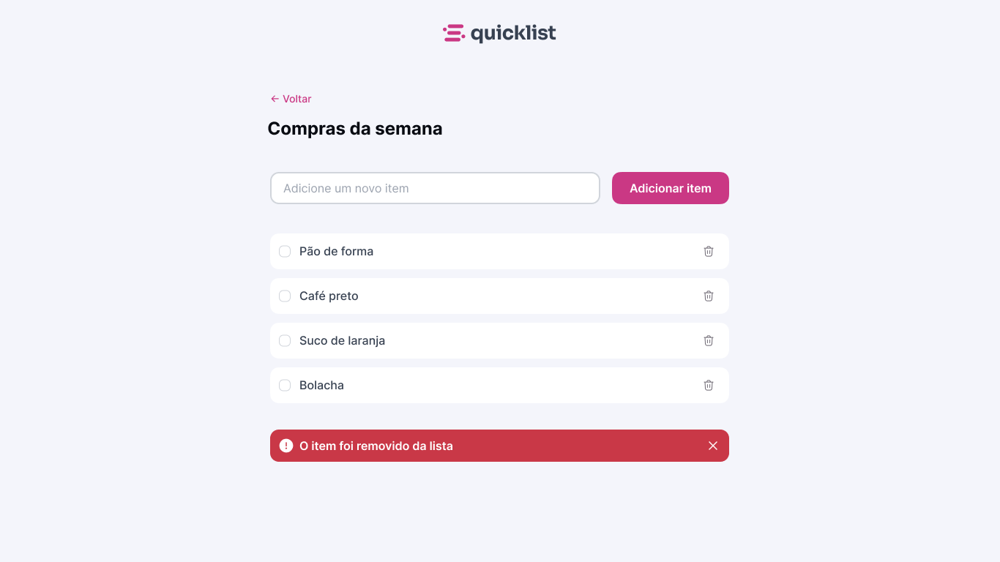

# Quicklist
### Projeto de estudo - Primeiro contato solo com JavaScript 

### 🚀 Tecnologias

Esse projeto foi desenvolvido com as seguintes tecnologias:

- HTML
- CSS
- JavaScript

### 💻 Projeto

Aplicação Web de uma lista de compras

- Manipulação de tags HTML
- Function para aparecer em tela um input estilizado
- Uso de if/else
- Aplicação de try - catch
- addEventListener para o btn de delete
  - Aparecimento após clique
  - Sumiço após 3 segundos
  - Opção de remoção da mensagem ao clicar no 'x'

### 🔖 Layout

Você pode visualizar o layout do projeto através [desse link](https://www.figma.com/design/OYW0AaJa2v6tlELy1bxARP/Lista-de-compras--Community-?node-id=3108-1350&t=8CcrVW0fYKYuebej-0). 

###  ACESSE A PÁGINA [AQUI](https://amandasgm.github.io/lista-de-compras/)

Feito by Amanda e ensinado/corregido com ♥ by Rocketseat 